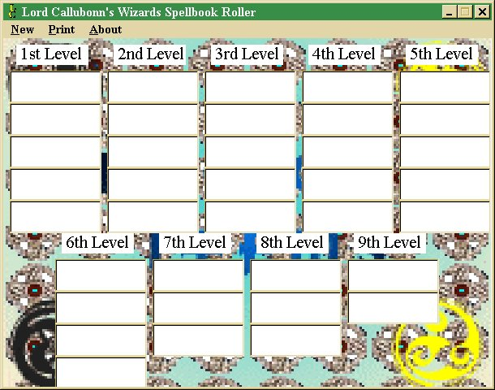



## AD&D Wizard's SpellBook Roller

### Description

Randomly reads from a .txt file using a listbox & a few simple lines of code. Great for quick charatcer creation & easy to update with .txt files. Learn & have fun.
 
### More Info
 
Uses no API or .BAS files.

Not much to complicated, can be used in toher programs with a few tweaks. Great for newbies to learn freefile & listbox capabilities.

Randomly loads txt from a text file into a listbox & then randomly reads & places the selected text into a textbox.

Sometimes shows a blank textbox, any help?

             |
---                |---
**Submitted On**   |2000-04-28 19:58:32
**By**             |[LordCallubonn](https://github.com/Planet-Source-Code/PSCIndex/blob/master/ByAuthor/lordcallubonn.md)
**Level**          |Beginner
**User Rating**    |3.8 (15 globes from 4 users)
**Compatibility**  |VB 5\.0, VB 6\.0
**Category**       |[Games](https://github.com/Planet-Source-Code/PSCIndex/blob/master/ByCategory/games__1-38.md)
**World**          |[Visual Basic](https://github.com/Planet-Source-Code/PSCIndex/blob/master/ByWorld/visual-basic.md)
**Archive File**   |[CODE\_UPLOAD138661172001\.zip](https://github.com/Planet-Source-Code/lordcallubonn-ad-d-wizard-s-spellbook-roller__1-14487/archive/master.zip)

